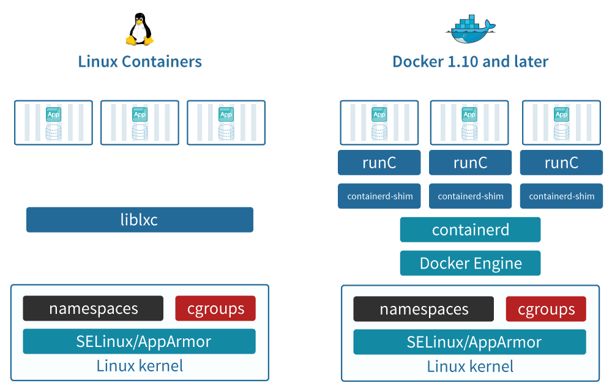

# Wstęp

W ostatnich latach na popularności zyskują tematy związane z izolacją 
aplikacji, konteneryzacją i zarządzaniem rozproszonymi systemami komputerowymi.

Sam problem izolacji systemów komputerowych istnieje już od dawna i dorobił
się wielu podejść do jego rozwiązania:

- rozwijane od późnych lat 60 wirtualne maszyny dzielące się na dwa rodzaje:
  - systemowe lub inaczej emulatory maszyn, w uproszczeniu polegają
    na uruchamianiu kompletnego systemu operacyjnego, który nie zdaje sobie
    sprawy ze współdzielenia zasobów "myśląc", że posiada całą fizyczną maszynę
    na własność. Możliwe jest uruchomienie całkiem innego systemu operacyjnego
    jako gościa;
    
  - działające na poziomie procesu; oferują przede wszystkim izolację
    zależności i niezależność od systemu operacyjnego, można tu
    wyróżnić między innymi:
    - interpretery (np. _CPython_ lub _Lua_),
    - kompilatory JIT (np. _Jython_, _PyPy_, _LuaJIT_, _.NET_),
    - maszyny wirtualne języków programowania (np. _Java_ lub _V8_);
    
- wprowadzony w roku 1979 _chroot_ polegający na uruchomieniu procesu ze
  zmienionym drzewem systemu plików, z którego nie może się wydostać;

- parawirtualizacja, która jest podobna do systemowych wirtualnych maszyn,
  z tą różnicą, że przekierowuje zapytania systemowe do systemu-gospodarza.
  Ten typ wirtualizacji nie pozwala na uruchomienie całkiem innego systemu
  operacyjnego i wymaga kompatybilności systemu-gościa.
  Przykładem jej implementacji są _jail_ z _FreeBSD_ lub _LXC_ 
  (_Linux Containers_).

\pagebreak
## Konteneryzacja

Pełna wirtualizacja systemów operacyjnych świetnie się sprawdza przy
współdzieleniu zasobów sprzętowych z niezaufanymi użytkownikami. Na przykład
w centrach danych lub usługach chmurowych.

Natomiast rozwój realnych aplikacji i usług internetowych dąży do izolacji
jak najmniejszych ich części na poziomie pojedynczego procesu.
Niektórzy idą dalej i rozbijają procesy na jeszcze mniejsze jednostki (tzw.
mikroserwisy) ograniczając ich funkcjonalność do minimum.

Zastosowanie w tym przypadku pełnej wirtualizacji skutkowałby
nieproporcjonalnie dużym narzutem zasobów sprzętowych, a przez to finansowych,
w stosunku do uruchamianej aplikacji. Standardowe narzędzia parawirtualizacji
zmniejszają ten narzut, ale nadal jest znaczny i wymaga dalszej optymalizacji.

W ten sposób zrodziła się idea konteneryzacji. Polega ona na:

- uruchamianiu pojedynczych procesów,
- działaniu we w pełni skonfigurowanym środowisku niezależnym od innych procesów
  współdzielących system operacyjny,
- dążeniu do minimalizacji kosztów uruchamiania kolejnych procesów.

Warto tu zaznaczyć, że konteneryzacja nie jest jedynym narzędziem lub gotowym
rozwiązaniem. Jest natomiast dobrze określonym zbiorem problemów i recept na ich
rozwiązanie.

\pagebreak
Konteneryzację realizuje się łącząc wiele istniejących lub nowych narzędzi
optymalizowanych w konkretnym celu. Sytuację dobrze ilustruje poniższe porównanie _LXC_
z _Dockerem_:

{width=500 height=320}\

Jak widać na powyższej ilustracji zarówno _LXC_ jak i _Docker_ bazują na kernelu
_Linuxa_, w tym: _SELinux_ lub _AppArmor_, namespaces i _cGroups_.
Różnią się natomiast implementacją samych kontenerów - _LXC_ korzysta jedynie z
_liblxc_, a _Docker_ postanowił zaimplementować wielopoziomowy system:
_Docker Engine_, _containerd_ i _runc_.

## Cel pracy inżynierskiej

Celem tej pracy jest: 1) przedstawienie podstawowych pojęć związanych
z aktualnie najpopularniejszym rozwiązaniem zarządzania kontenerami o nazwie
_Kubernetes_, 2) przegląd dostępnych rozwiązań oraz
wdrożenie tego  systemu w sieci uczelnianej na potrzeby prowadzenia
laboratoriów ze studentami.

Wdrożenie w sieci uczelnianej wiąże się z koniecznością uruchomienia systemu
z sieci na maszynach bezdyskowych.

Celem dodatkowym jest przeprowadzenie testów wydajnościowych klastra _Kubernetes_.
