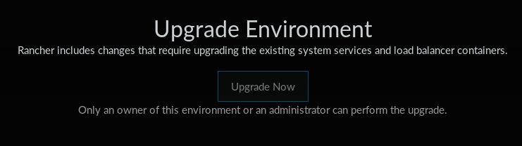

## Rancher 2.0

Jest to wygodne narzędzie do uruchamiania i monitorowania klastra `k8s`.
Wersja 2.0 (obecnie w fazie alpha) oferuje lepszą integrację z `k8s`
całkowicie porzucając inne platformy.

W trakcie pisania pracy (24 stycznia 2018) pojawiło się drugie Tech Preview.
W stosunku do pierwszego Tech Preview aplikacja została mocno przebudowana i
nie wspiera jeszcze konfiguracji sprzętowej, więc jestem zmuszony odrzucić to
rozwiązanie.

\

#### Uruchamianie wersji `v2.0.0-alpha10`

Testy przeprowadziłem na maszynach wirtualnych `VirtualBox` w trybie bezdyskowym
systemu operacyjnego `CoreOS` z wykorzystaniem repozytorium
[`ipxe-boot`](https://github.com/nazarewk/ipxe-boot).

Węzeł zarządzający uruchomiłem poniższą komendą:

```bash
docker run --rm --name rancher -d -p 8080:8080 rancher/server:v2.0.0-alpha10
```

Pierwszym krokiem było zalogowanie się do panelu administracyjnego Ranchera
dostępnego na porcie 8080 lokalnej maszyny i uzyskanie komendy konfigurującej
węzeł roboczy. Kolejnym i ostatnim krokiem konfiguracji było uruchomienie
uzyskanej komendy na dowolnej liczbie węzłów roboczych:
    
```bash
sudo docker run --rm --privileged \
  -v /var/run/docker.sock:/var/run/docker.sock \
  -v /var/lib/rancher:/var/lib/rancher \
  rancher/agent:v1.2.9 \
  http://192.168.56.1:8080/v1/scripts/B52944BEFAA613F0CE90:1514678400000:E2yB6KfxzSix4YHti39BTw5RbKw
```

W ciągu 2 godzin przeglądu nie udało mi się zautomatyzować procesu uzyskiwania
ww. komendy.

##### Napotkane błędy

W wersji `v2.0.0-alpha10` losowo pojawia się błąd
[Upgrade Environment](https://github.com/rancher/rancher/issues/10396).

{width=500 height=140}\


#### Wnioski

Rancher na chwilę obecną (styczeń 2018 roku) jest bardzo wygodnym, ale również
niestabilnym rozwiązaniem.
Ze tego względu odrzucam Ranchera jako rozwiązanie problemu uruchamiania
klastra `k8s`.
