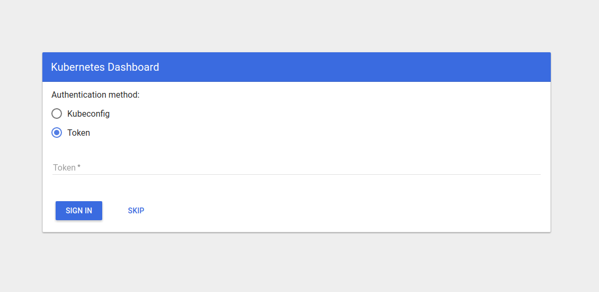
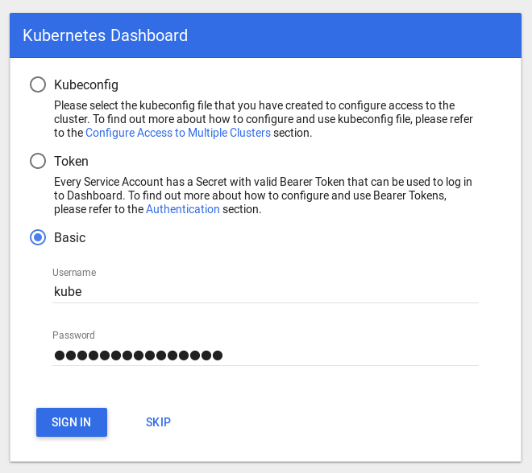

# Uruchamianie Kubernetesa w laboratorium 225

## Przygotowanie węzłów CoreOS

Na wstępie przygotowałem `coreos.ipxe` i `coreos.ign` do rozruchu i bezhasłowego dostępu.

Po pierwsze stworzyłem Container Linux Config (plik `coreos.yml`) zawierający:

1. Tworzenie użytkownika `nazarewk`,
2. Nadanie mu praw do sudo i dockera (grupy `sudo` i `docker`),
3. Dodanie dwóch kluczy: wewnętrznego uczelnianego i mojego używanego na codzień
  w celu zdalnego dostępu.

```yaml
passwd:
  users:
  - name: nazarewk
    groups: [sudo, docker]
    ssh_authorized_keys:
    - ssh-rsa <klucz RSA> nazarewk
    - ssh-rsa <klucz RSA> nazarewk@ldap.iem.pw.edu.pl
```

Następnie skompilowałem go do formatu Ignition narzędziem `ct`, skryptem
`bin/render-coreos` z wykazu.

Przygotowałem skrypt `IPXE` do uruchamiania CoreOS `zetis/WWW/boot/coreos.ipxe`.

Umieściłem skrypt w `/home/stud/nazarewk/WWW/boot` i wskazałem go maszynom,
które będą węzłami:
```bash
sudo lab 's4 s5 s6 s8 s9' boot http://vol/~nazarewk/boot/coreos.ipxe 
```


## Przeszkody związane z uruchamianiem skryptów na uczelnianym Ubuntu

#### Brak virtualenv'a
Moje skrypty nie przewidywały braku `virtualenva`, więc musiałem ręcznie
zainstalować go komendą `apt-get install virtualenv`.
Dodałem ten krok do skryptu `setup-packages`.

#### Klonowanie repozytorium bez logowania

W celu umożliwienia anonimowego klonowania repozytorium z Githuba,
zmieniłem protokół z `git` na `https`:

    git clone https://github.com/nazarewk/kubernetes-cluster.git

Problem pojawił się również dla submodułów gita (`.gitmodules`).

#### Atrybut wykonywalności skryptów

W konfiguracji uczelnianej git nie ustawia domyślnie atrybutu wykonalności
dla plików wykonywalnych i zdejmuje go przy aktualizacji pliku.
Problem rozwiązałem dodaniem komendy `chmod +x bin/*` do skryptu `pull`.

#### Konfiguracja dostępu do maszyn bez hasła

Poza konfiguracją `CoreOS` wypełem konfigurację SSH do bezhasłowego
dostępu. W pliku `~/.ssh/config` umieściłem:

```
Host s?
  User admin
  
IdentityFile ~/.ssh/id_rsa
IdentitiesOnly yes

Host s?
  StrictHostKeyChecking no
  UserKnownHostsFile /dev/null
```

#### Problemy z siecią

W trakcie pierwszego uruchamiania występowały problemy z siecią uczelnianą, więc
rozszerzyłem plik `ansible.cfg` o ponawianie prób wywoływania komend dodając
wpis `retires=5` do sekcji `[ssh_connection]`.

#### Limit 3 serwerów DNS
Napotkałem [limit 3 serwerów DNS](https://github.com/kubernetes-incubator/kubespray/blob/master/docs/dns-stack.md#limitations):
```
TASK [docker : check system nameservers] **************************************
Friday 26 January 2018  14:47:09 +0100 (0:00:01.429)       0:04:26.879 ******** 
ok: [node3] => {"changed": false, "cmd": "grep \"^nameserver\" /etc/resolv.conf | sed 's/^nameserver\\s*//'", "delta": "0:00:00.004652", "end": "2018-01-26 13:47:11.659298", "rc": 0, "start": "2018-01-26 13:47:11.654646", "stderr": "", "stderr_lines": [], "stdout": "172.29.146.3\n1
72.29.146.6\n10.146.146.3\n10.146.146.6", "stdout_lines": ["172.29.146.3", "172.29.146.6", "10.146.146.3", "10.146.146.6"]}
...
TASK [docker : add system nameservers to docker options] **********************
Friday 26 January 2018  14:47:13 +0100 (0:00:01.729)       0:04:30.460 ******** 
ok: [node3] => {"ansible_facts": {"docker_dns_servers": ["10.233.0.3", "172.29.146.3", "172.29.146.6", "10.146.146.3", "10.146.146.6"]}, "changed": false}
...
TASK [docker : check number of nameservers] ***********************************
Friday 26 January 2018  14:47:15 +0100 (0:00:01.016)       0:04:32.563 ******** 
fatal: [node3]: FAILED! => {"changed": false, "msg": "Too many nameservers. You can relax this check by set docker_dns_servers_strict=no and we will only use the first 3."}
```

Okazało się, że maszyna `s8` była podłączona również na drugim interfejsie
sieciowym, w związku z tym miała zbyt dużo wpisów serwerów DNS.

Rozwiązałem problem ręcznie logując się na maszynę i wyłączając drugi
interfejs sieciowy komendą `ip l set eno1 down`.


## Pierwszy dzień - uruchamianie skryptów z maszyny s6
  
Większość przeszkód opisałem w powyższym rozdziale, więc w tym skupię się
tylko na problemach związanych z pierwszą próbą uruchomienia skryptów na 
maszynie s6.

Najpierw próbowałem uruchomić skrypty na maszynach: s2, s4 i s5
```bash
cd ~/kubernetes/kubernetes-cluster
bin/setup-cluster-full 10.146.255.{2,4,5}
```

Po uruchomieniu okazało się, że maszyna `s2` posiada tylko połowę RAMu (4GB) i
nie  mieszczą się na niej obrazy Dockera konieczne do uruchomienia klastra.

Kolejną próbą było uruchomienie na maszynach s4, s5, s8 i s9. Skończyło się
problemami z Vaultem opisanymi w dalszych rozdziałach.


## Kolejne próby uruchamiania klastra z maszyny s2

Dalsze testy przeprowadzałem na maszynach: s4, s5, s6, s8 i s9.

Najwięcej czasu spędziłem na rozwiązaniu problemu z DNSami opisanym wyżej.

#### Generowanie inventory z HashiCorp Vault'em

Skrypt `inventory_builder.py` z `Kubespray` generuje wpisy oznaczające węzły
jako posiadające HashiCorp Vaulta.

Uruchomienie z Vault'em zakończyło się błędem, więc wyłączyłem Vault'a
rozbijając skrypt `bin/setup-cluster-full` na krok konfiguracji i krok
uruchomienia, pomiędzy którymi mogłem wyedytować `inventory/inventory.cfg`:
```bash
    bin/setup-cluster-configure 10.146.255.{4,5,6,8,9}
    bin/setup-cluster
```

Próbowałem dostosować parametr [`cert_management`](https://github.com/kubernetes-incubator/kubespray/blob/master/docs/vault.md), 
żeby działał zarówno z `Vaultem` jak i bez, ale nie dało to żadnego skutku.
Objawem było nie uruchamianie się `etcd`.

Uznałem, że taka konfiguracja jeszcze nie działa i zarzuciłem dalsze próby.
Aby rozwiązać problem trzeba usunąć wpisy pod kategorią `[vault]` z pliku
`inventory.cfg`. 

#### Niepoprawne znajdowanie adresów IP w ansible

Z jakiegoś powodu konfiguracje `s6` (node3) i `s8` (node4) kończyły się błędem:
```
TASK [kubernetes/preinstall : Stop if ip var does not match local ips] ********
Friday 26 January 2018  16:37:48 +0100 (0:00:01.297)       0:00:48.587 ********
fatal: [node4]: FAILED! => {
    "assertion": "ip in ansible_all_ipv4_addresses",
    "changed": false,
    "evaluated_to": false
}
fatal: [node3]: FAILED! => {
    "assertion": "ip in ansible_all_ipv4_addresses",
    "changed": false,
    "evaluated_to": false
}
```
Trzy dni później nie wprowadzając po drodze żadnych zmian uruchomiłem klaster
bez problemu.

Przyczyną błędu okazały się pozostałości konfiguracji maszyn niezależne ode mnie.

#### Dostęp do Kubernetes Dashboardu

`Kubernetes Dashboard` jest dostępny pod poniższą ścieżką HTTP:

    /api/v1/namespaces/kube-system/services/https:kubernetes-dashboard:/proxy/#!/service/default/kubernetes

Można się do niego dostać na dwa sposoby:

1. `kubectl proxy`, które wystawia dashboard na adresie `http://127.0.0.1:8001`
2. Pod adresem `https://10.146.225.4:6443`, gdzie `10.146.225.4` to adres IP
  dowolnego mastera, w tym przypadku maszyny `s4`
  
Kompletne adresy to:
 
    http://127.0.0.1:8001/api/v1/namespaces/kube-system/services/https:kubernetes-dashboard:/proxy/#!/service/default/kubernetes
    https://10.146.225.4:6443/api/v1/namespaces/kube-system/services/https:kubernetes-dashboard:/proxy/#!/service/default/kubernetes

##### Przekierowanie portów
Jeżeli nie pracujemy z maszyny uczelnianej porty możemy przekierować przez SSH
na następujące sposoby (jeżeli skrypty uruchamialiśmy z maszyny `s2` i łączymy
się do mastera na maszynie `s4`):

1. Plik `~/.ssh/config`:
  ```
  Host s2
    LocalForward 127.0.0.1:8001 localhost:8001
    LocalForward 127.0.0.1:6443 10.146.225.4:6443
  ```
2. Argumenty ssh, np.: 
  ```
  ssh -L 8001:localhost:8001 -L 6443:10.146.225.4:6443 nazarewk@s2
  ```


##### Użytkownik i hasło
Domyślna nazwa użytkownika Dashboardu to `kube`, a hasło znajduje się w pliku
`credentials/kube_user`.

W starszej wersji (uruchamianej wcześniej) `k8s` i/lub `Kubespray` brakowało
opcji logowania przy pomocy nazwy użytkownika i hasła:

{width=500 height=240}\
Od 29 stycznia 2018 roku widzę poprawny ekran logowania (opcja Basic):

{width=500 height=445}\

#### Instalacja dodatkowych aplikacji z użyciem Kubespray

`Kubespray` ma wbudowaną instalację kilku dodatkowych aplikacji
playbookiem `upgrade-cluster.yml` z tagiem `apps` (skrypt `bin/setup-cluster-upgrade`).

Zmieniłem `kube_script_dir` na lokalizacje z poza `/usr/local/bin`, 
bo w systemie `CoreOS` jest read-only squashfsem, wybrałem `/opt/bin` ponieważ
znajdował się już w `PATHie` na `CoreOS`. Później dowiedziałem się, że domyślnie
zmiany `CoreOS` powinny być umieszczane w folderze `/opt`

W końcu ze względu na liczne błędy zarzuciłem temat.

#### Instalacja Helm

[`Helm`](https://github.com/kubernetes/helm) jest menadżerem pakietów dla
`k8s`. Jego głównym zadaniem jest standaryzacja, automatyzacja i ułatwienie
instalacji aplikacji w `k8s`.

`Helm` składa się z:

- programu `helm` uruchamianego lokalnie i korzystającego z danych dostępowych
  `kubectla`,
- aplikacji serwerowej `Tiller`, z którą `helm` prowadzi interakcje,
- pakietów `Charts` i ich repozytoriów, domyślnie jest to [`kubernetes/charts`](https://github.com/kubernetes/charts),

Jego instalacja sprowadza się do:

1. ściągnięcia pliku wykonywalnego dla obecnej architektury,
2. dodania roli RBAC dla `Tillera`,
3. Wywołanie komendy `helm init --service-account tiller`

Wszystkie kroki zawierają się w skrypcie `bin/install-helm`.
Ze względu na braku dystrybucji `Helm` na `FreeBSD` całość uruchamiam przez SSH
na węźle-zarządcy (domyślnie `s4`).

Szybko okazało się, że większość pakietów wymaga trwałych zasobów dyskowych i
nie uda się ich uruchomić bez ich konfiguracji w sieci uczelnianej.

