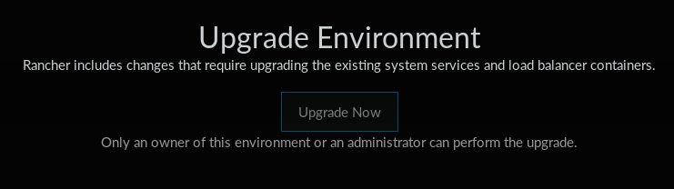

# Konfiguracja klastra Kubernetes

Najpopularniejszym rozwiązaniem konfiguracji klastra Kubernetes jest 
[kops](https://github.com/kubernetes/kops), ale jak większość rozwiązań zakłada
uruchomienie w środowiskach chmurowych, PaaS lub IaaS. W związku z tym nie ma
żadnego zastosowania w tej pracy inżynierskiej.

## Rancher 2.0 {#rancher-kubernetes}

Wygodne narzędzie do uruchamiania i monitorowania klastra Kubernetes, ale wymaga
interakcji użytkownika.
Wersja 2.0 (obecnie w fazie alpha) oferuje lepszą integrację z Kubernetes
całkowicie porzucając inne platformy.

```bash
#rancher_version=latest
rancher_version=preview
docker run --rm --name rancher -d -p 8080:8080 rancher/server:${rancher_version}
```

Najpierw należy zalogować się do panelu administracyjnego Ranchera i 
przeprowadzić podstawową konfigurację (adres Ranchera + uzyskanie komendy).

Następnie w celu dodania węzła do klastra wystarczy wywołać jedną komendę 
udostępnioną w panelu administracyjnym Ranchera na docelowym węźle, 
jej domyślny format to:
    
```bash
wersja_agenta=v1.2.9
ip_ranchera=192.168.56.1
skrypt=B52944BEFAA613F0CE90:1514678400000:E2yB6KfxzSix4YHti39BTw5RbKw

sudo docker run --rm --privileged \
  -v /var/run/docker.sock:/var/run/docker.sock \
  -v /var/lib/rancher:/var/lib/rancher \
  rancher/agent:${wersja_agenta} \
  http://${ip_ranchera}:8080/v1/scripts/${skrypt}
```

W ciągu 2 godzin przeglądu nie udało mi się zautomatyzować procesu uzyskiwania
ww. komendy.

Następnie w cloud-config'u RancherOS'a możemy dodać ww. komendę w formie:
```yaml
#cloud-config
runcmd:
- docker run --rm --privileged -v /var/run/docker.sock:/var/run/docker.sock -v /var/lib/rancher:/var/lib/rancher rancher/agent:v1.2.9 http://192.168.56.1:8080/v1/scripts/...
```

Od wersji 2.0 umożliwia połączenie się z istniejącym klastrem:

    kubectl apply -f http://192.168.56.1:8080/v3/scripts/303F60E1A5E186F53F3F:1514678400000:wstQFdHpOgHqKahoYdmsCXEWMW4.yaml


W wersji `v2.0.0-alpha10` losowo pojawia się błąd
[Upgrade Environment](https://github.com/rancher/rancher/issues/10396).

{width=500 height=140}


## kubespray-cli

Z powodu [błędu](https://github.com/kubespray/kubespray-cli/issues/120)
logiki narzędzie nie radzi sobie z brakiem Python'a na domyślnej dystrybucji 
CoreOS'a, mimo że sam `kubespray` radzi sobie z nim świetnie.
Do uruchomienia na tym systemie potrzebne jest ręczne wywołanie roli 
[`bootstrap-os`](https://github.com/kubernetes-incubator/kubespray/blob/master/roles/bootstrap-os/tasks/main.yml)
z `kubespray` zanim przystąpimy do właściwego deploy'u.

```{.bash include=ipxe-boot/bin/kubernetes-kubespray-cli.sh}
```

Wykrzacza się na kroku czekania na uruchomienie `etcd` ponieważ oczekuje 
połączenia na NATowym interfejsie z adresem `10.0.3.15` zamiast host network
z adresem `192.168.56.10`, stąd `ansible_default_ipv4.address`.


## kubespray

Kod znajduje się w moim repozytorium
[kubernetes-cluster](https://github.com/nazarewk/kubernetes-cluster).

```{.bash include=kubernetes-cluster/bin/setup-cluster}
```


### Kubernetes Dashboard
Dostęp do Dashboardu najprościej można uzyskać:

1. [nadanie wszystkich uprawnień roli `kubernetes-dashboard`](https://github.com/kubernetes/dashboard/wiki/Access-control#admin-privileges)
2. Wejście na http://localhost:8001/api/v1/namespaces/kube-system/services/https:kubernetes-dashboard:/proxy/#!/login
3. Kliknięcie skip

```{.bash include=kubernetes-cluster/bin/dashboard}
```

Linki:

- https://github.com/kubernetes/dashboard/wiki/Access-control
- https://github.com/kubernetes-incubator/kubespray/blob/master/docs/getting-started.md#accessing-kubernetes-dashboard


### Napotkane błędy

Błąd przy ustawieniu `loadbalancer_apiserver.address` na `0.0.0.0`:
```
TASK [kubernetes-apps/cluster_roles : Apply workaround to allow all nodes with cert O=system:nodes to register] ************************************
Wednesday 17 January 2018  22:22:59 +0100 (0:00:00.626)       0:08:31.946 *****
fatal: [node2]: FAILED! => {"changed": false, "msg": "error running kubectl (/opt/bin/kubectl apply --force --filename=/etc/kubernetes/node-crb.yml) command (rc=1): Unable to connect to the server: http: server gave HTTP response to HTTPS client\n"}
fatal: [node1]: FAILED! => {"changed": false, "msg": "error running kubectl (/opt/bin/kubectl apply --force --filename=/etc/kubernetes/node-crb.yml) command (rc=1): Unable to connect to the server: http: server gave HTTP response to HTTPS client\n"}
```

## OpenShift Origin

Według dokumentacji są dwie metody uruchamiania serwera, w dockerze
i na systemie linux.

```bash
# https://docs.openshift.org/latest/getting_started/administrators.html#installation-methods
docker run -d --name "origin" \
  --privileged --pid=host --net=host \
  -v /:/rootfs:ro \
  -v /var/run:/var/run:rw \
  -v /sys:/sys \
  -v /sys/fs/cgroup:/sys/fs/cgroup:rw \
  -v /var/lib/docker:/var/lib/docker:rw \
  -v /var/lib/origin/openshift.local.volumes:/var/lib/origin/openshift.local.volumes:rslave \
  openshift/origin start
```

OpenShifta próbowałem uruchomić na następujących systemach obiema metodami:

- Arch Linux `Linux krna 4.14.13-1-ARCH #1 SMP PREEMPT Wed Jan 10 11:14:50 UTC 2018 x86_64 GNU/Linux`
- CoreOS `Linux localhost 4.14.11-coreos #1 SMP Fri Jan 5 11:00:14 UTC 2018 x86_64 Intel(R) Core(TM) i5-2500K CPU @ 3.30GHz GenuineIntel GNU/Linux`

We wszystkich konfiguracjach obie metody
[skutkują błędem](https://github.com/openshift/origin/issues/14766):

```
F0120 19:18:58.708005   25376 node.go:269] failed to run Kubelet: failed to create kubelet: misconfiguration: kubelet cgroup driver: "systemd" is different from docker cgroup driver: "cgroupfs"
```
